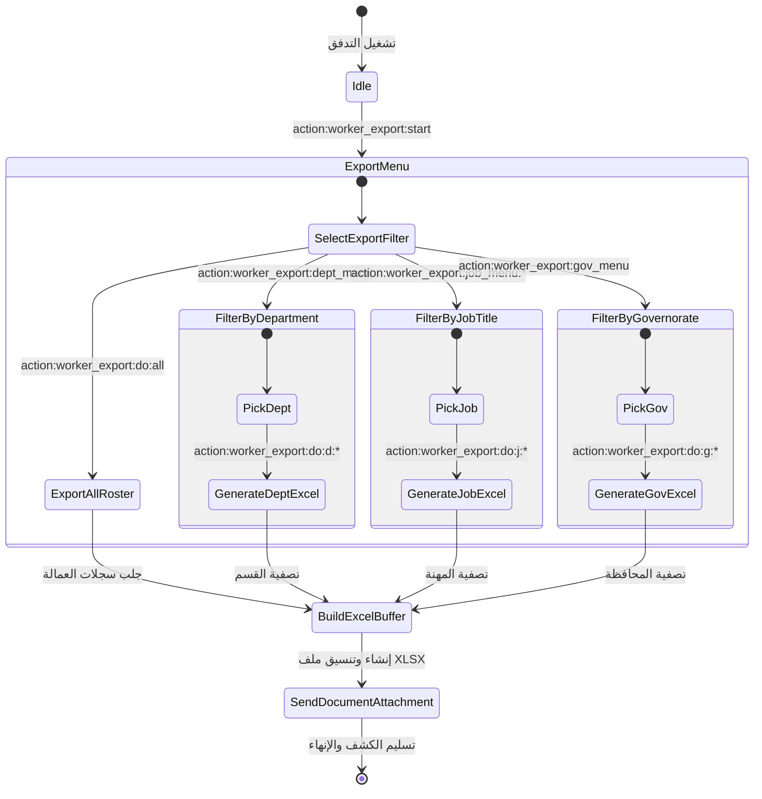

# تدفق 01.4: تصدير واستيراد كشوف العمالة (Excel Import & Export)
## Flow 01.4: Worker Excel Roster Export & Bulk Import Hub

> **الموديول:** `modules/workforce`  
> **كود التدفق:** `01.4`  
> **الرتب المصرح لها:** `SUPER_ADMIN`, `GENERAL_ADMIN`  
> **ميزانية التيليجرام:** 36/16/7/3  
> **حالة التدفق:** 🟢 مكتمل وموثق 100%  

---

### 🗺️ مخطط دورة حياة التدفق (State Machine Diagram)

---

### 🛡️ القواعد الحوكمية المعمارية المطبقة
1. **عقد الشريحة الرأسية (Gate G2):** توليد ملفات Excel في الذاكرة دون تلويث القرص بملفات مؤقتة.
2. **ميزانية التيليجرام (Gate G5):** إرسال الكشف كمستند (`sendDocument`) مع كابشن لا يتجاوز 1024 حرفاً.
3. **أمان البيانات (Gate G8):** قصر التصدير الشامل للرواتب على الحسابات الإدارية المعتمدة.
