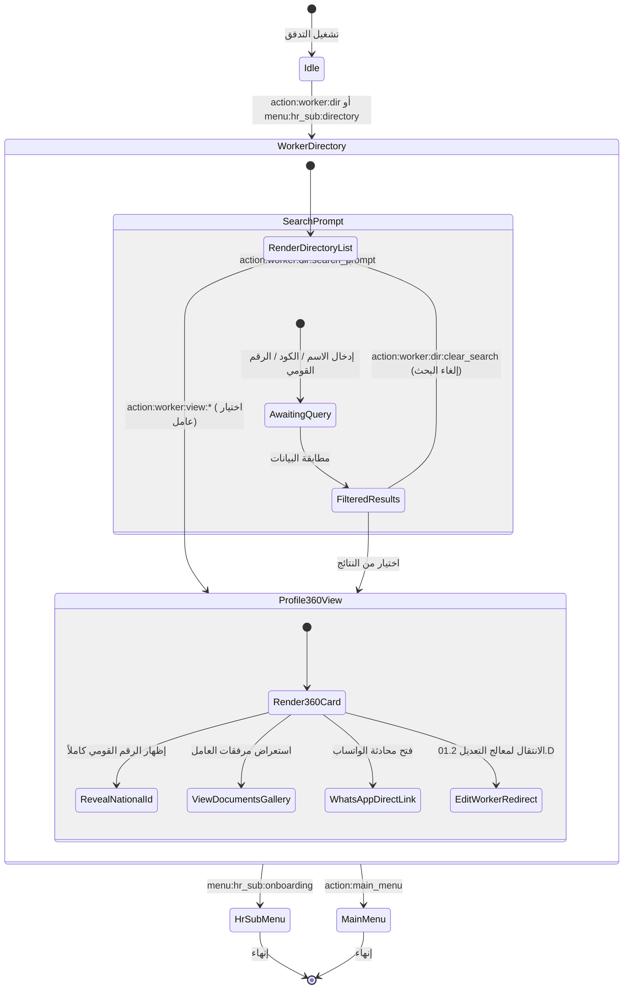

# تدفق 01.5: دليل وسجلات العاملين والملف الشامل 360 (Worker Directory)
## Flow 01.5: Worker Directory, Search & Profile 360 Hub

> **الموديول:** `modules/workforce`  
> **كود التدفق:** `01.5`  
> **الرتب المصرح لها:** `SUPER_ADMIN`, `GENERAL_ADMIN`, `FIELD_ADMIN`  
> **ميزانية التيليجرام:** 36/16/7/3  
> **حالة التدفق:** 🟢 مكتمل وموثق 100%  

---

### 🗺️ مخطط دورة حياة التدفق (State Machine Diagram)

---

### 🛡️ القواعد الحوكمية المعمارية المطبقة
1. **عقد الشريحة الرأسية (Gate G2):** اعتماد مكون `buildWorkerPickerKeyboard` الموحد من `@alsaada/core-components`.
2. **ميزانية التيليجرام (Gate G5):** الالتزام بألا يتجاوز طول الـ Callback الـ 36 بايت.
3. **حماية الخصوصية (Gate G8):** تشفير وحجب الرقم القومي ما لم يطلب المستخدم المصرح له إظهاره صراحة.
