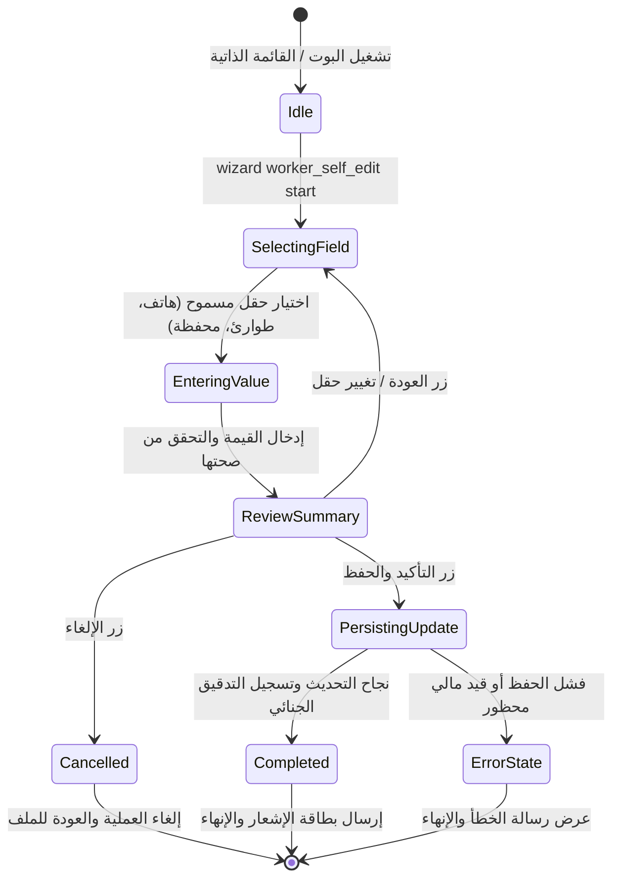

# تدفق 01.6: طلب تعديل وتحديث بيانات العامل ذاتياً (Worker Self-Edit)

## الوصف المعماري
يتيح هذا التدفق للعامل المسجل والمفعل في المنظومة تحديث بياناته الشخصية والتواصلية ذاتياً عبر بوت التيليجرام، مع التطبيق الصارم لميثاق النزاهة والحظر المالي (`Zero Financial Mutation`).

## الحقول المسموح بتعديلها
- `phone`: رقم الهاتف الشخصي
- `emergencyContactName`: اسم جهة الاتصال للطوارئ
- `emergencyPhone`: رقم هاتف الطوارئ
- `address`: محل الإقامة
- `walletType`: نوع المحفظة الإلكترونية
- `accountNumber`: رقم المحفظة / الحساب
- `walletOwnerName`: اسم صاحب المحفظة
- `instaPayHandle`: معرف إنستاباي
- `maritalStatus`: الحالة الاجتماعية
- `ppeShoeSize`: مقاس الحذاء الميداني
- `ppeUniformSize`: مقاس الزي الميداني

## الحقول المالية المحظورة قطيعاً
- `dailyWage` (الأجر اليومي)
- `basicSalary` (الراتب الأساسي)
- `fixedAllowances` (البدلات)
- `jobTitle` (المسمى الوظيفي)
- `siteId` (موقع العمل الميداني)
- `shiftSystem` (نظام الدوام)
- `insuranceNumber` (الرقم التأميني)

## الأمان والتدقيق الجنائي
- تسجيل كل تعديل في جدول `AuditLog` موثقاً بالمعرف الرقمي وقيمتي ما قبل وبعد التعديل.
- إطلاق حدث في طابور `OutboxEvent` للمزامنة الخلفية مع سجلات العمالة.

## مخطط حالات التدفق (State Machine Diagram)

