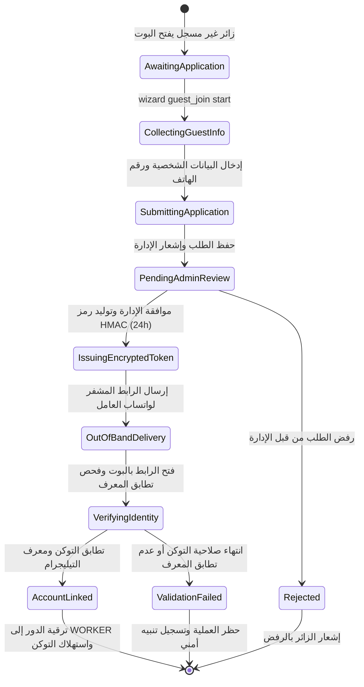

# تدفق 01.7: محرك طلبات انضمام الزوار والربط المشفر عبر الواتساب (Guest Join & WhatsApp Linking)

## الوصف والهدف المعماري
محرك مصادقة خارج النطاق (`Out-of-Band Cryptographic Authentication Engine`) لحماية حسابات العمال من الاختطاف أو الانتحال عند تقديم طلبات الانضمام من الزوار.

## المعايير والضوابط المعتمدة
1. **صلاحية الرمز الرقمي المشفر (TTL):**
   - صلاحية الرابط هي **24 ساعة كاملة (86,400 ثانية)**.
2. **الربط التشفيري الصارم بمعرف التليجرام:**
   - التوكن موقع بختم HMAC-SHA256 ومربوط بمعرف مقدم الطلب (`applicantTelegramId`).
   - عند فتح الرابط في البوت يتم فحص `ctx.from.id === tokenPayload.applicantTelegramId`. أي عدم تطابق يؤدي إلى رفض العملية فورياً.
3. **الإرسال الحصري لواتساب الرقم المسجل:**
   - يوجه النظام الإدارة لإرسال الرابط المشفر حصراً إلى رقم الهاتف المعتمد في ملف العامل بالشركة.
4. **استهلاك لمرة واحدة (Single-Use):**
   - يُبطل الرمز تلقائياً فور استهلاكه بنجاح لتفعيل الحساب.

## أثر البيانات
- تفعيل الحساب: `User.role = 'WORKER'`, `User.workerId = worker.id`.
- ربط العامل: `Worker.telegramId = applicantTelegramId`.
- تفريغ الكاش وتحديث الأوامر الجانبية فورياً.

## مخطط حالات التدفق (State Machine Diagram)

