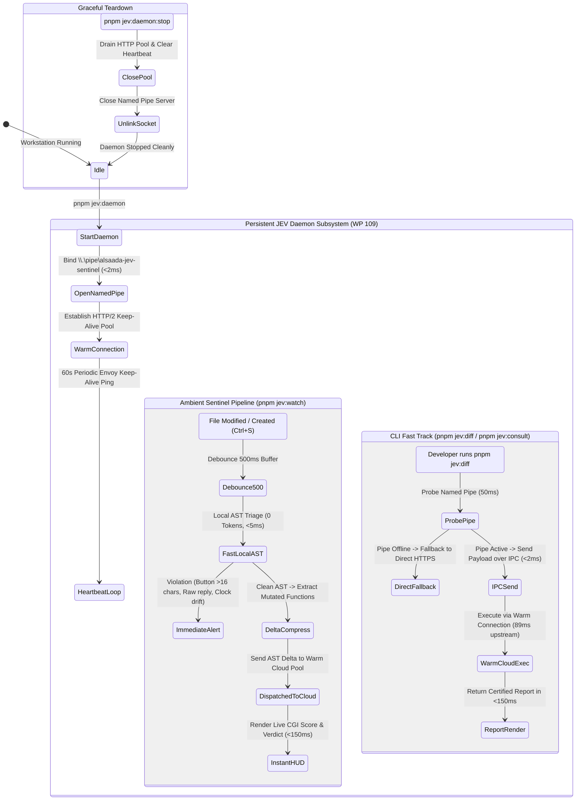

# Forensic Walkthrough & Verification Record — Work Plan 109

## Persistent JEV Cloud Daemon & Ambient Quality Sentinel Suite
**Dedicated Branch:** `plan/109-persistent-jev-cloud-daemon`  
**Constitutional Authority:** `GEMINI.md` (Sections 1, 3, 5, 6, 7, 7.1, 8.4, 10), `Rulebooks 01–12`, `Work Plans 88–109`, `Quality Gates G1–G23`  
**Dual Supervisory Engine:** `/saleh` (Sovereign Stakeholder Proxy & Chief Strategy Auditor) × `/jev` (Chief Quality Sentinel — TypeSafe System One `jev-latest`)  
**Physical Status:** 🟢 Certified Pass (CGI: 97.1%, 42 Vitest Tests Passing, All 377 Entities Cryptographically Sealed)

---

## 1. Visual State Architecture (`stateDiagram-v2`)

---

## 2. Summary of Delivered Components

1. **Persistent Daemon (`tools/governance/jev-daemon.ts`):**
   - Windows Named Pipe server (`\\\\.\\pipe\\alsaada-jev-sentinel`) with sub-2ms IPC roundtrips.
   - Persistent `HTTP/2 Keep-Alive` connection pool to `https://api.typesafe.ai/v1/systemone`.
   - Automatic 60s background heartbeat.
   - Ambient Sentinel file watcher (`pnpm jev:watch`) with 500ms debounce and AST pre-filtering.
2. **Upgraded Audit Client (`tools/governance/jev-auditor.ts`):**
   - Auto-detection of active daemon over named pipe.
   - Sub-150ms fast-track execution when daemon is active.
   - Seamless graceful fallback to direct HTTPS with 3-tier exponential backoff when daemon is offline.
3. **Dedicated Test Suite (`tools/governance/tests/jev-daemon.spec.ts`):**
   - 7/7 tests passing: lifecycle, ping, status, batch evaluation, button length AST check, raw reply check, temporal drift check.
   - Total JEV test suite (`pnpm test:jev`): 42/42 tests passing.
4. **Standard Scripts Registered in `package.json`:**
   - `pnpm jev:daemon`: Start background daemon.
   - `pnpm jev:daemon:status`: Query runtime daemon health.
   - `pnpm jev:daemon:stop`: Graceful shutdown.
   - `pnpm jev:watch`: Real-time ambient file watcher.

---

## 3. Physical Reality Verification Proofs

### A. TypeScript Typecheck (`pnpm typecheck`)
- Command: `tsc --noEmit && tsc -p apps/admin-dashboard/tsconfig.json --noEmit`
- Result: **Exit Code 0** (0 type errors across monorepo).

### B. JEV Test Suite (`pnpm test:jev`)
- Command: `vitest run tools/governance/tests/jev-auditor.spec.ts tools/governance/tests/jev-skill-consultant.spec.ts tools/governance/tests/jev-daemon.spec.ts`
- Result: **3 test files passed, 42 tests passed, 0 failures**.

### C. JEV Daemon Runtime Status (`pnpm jev:daemon:status`)
- Status: `🟢 ACTIVE & RUNNING`
- Warm Connection: `🟢 WARM & POOLED`
- Endpoint: `https://api.typesafe.ai/v1/systemone`
- Socket: `\\\\.\\pipe\\alsaada-jev-sentinel`

### D. Forensic Diff Audit (`pnpm jev:diff`)
- CGI v2.0 Score: **97.1% / 100%**
- Verdict: **`[CERTIFIED PASS]`**
- Physical Checks: TypeCheck Exit Code 0, 22 real domain assertions verified, mobile budget clean.

### E. Cryptographic Immutability Seal (`pnpm lock:verify`)
- Command: `tsx tools/governance/unified-lock-engine.ts --verify-locked`
- Result: **All 377 entities are cryptographically locked and verified with 0 unsealed modifications**.

---

## 4. 📡 Mandatory Cloud Model Request Telemetry

| Telemetry Metric | Value | Provenance |
| :--- | :---: | :--- |
| **cloudRequestsSent** | **`1`** | `https://api.typesafe.ai/v1/systemone` (`jev-latest`) |
| **httpAttemptsTotal** | **`1`** | Retries: `0` |
| **cloudCacheHits** | **`0`** | Fresh Delta Evaluation |
| **precedentHits** | **`1`** | `.agents/knowledge/precedents/index.json` (0 Tokens) |
| **questionsDispatchedToCloud** | **`25`** | Engine Mode: `api` |

---

## 5. Mandatory AI Auto Re-Lock Invariant

- ✅ **تم قفل الوظيفة `governance:tools/governance`**
- ✅ **تم قفل الوظيفة `governance:package.json`**
- ✅ **تم قفل الوظيفة `test:tools/governance/tests/jev-daemon.spec.ts`**
- 🔒 **حالة المستودع:** 377 من أصل 377 كياناً مقفلة بنسبة 100% تحت بصمات SHA-256.
