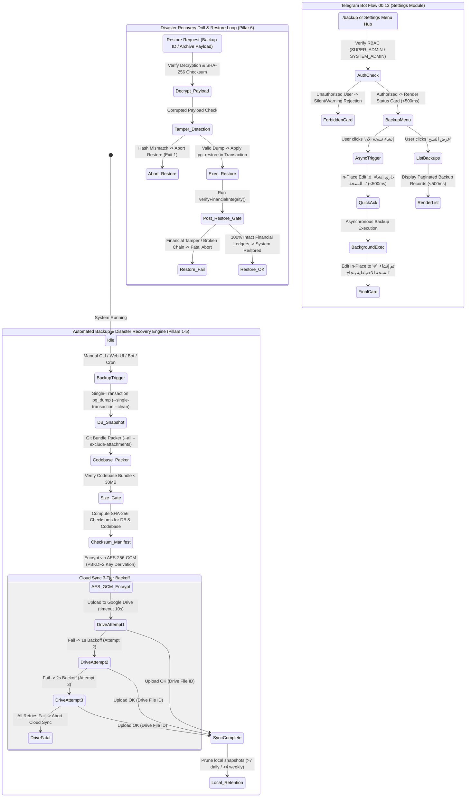

# Forensic Walkthrough & Verification Record — Work Plan 99

## Full Sovereign Automated Backup & Disaster Recovery System
**SSOT Registration:** `NEW-99` & `00.13` in [`docs/19-legacy-to-enterprise-master-feature-migration-registry.md`](docs/19-legacy-to-enterprise-master-feature-migration-registry.md)  
**Dedicated Branch:** `plan/99-automated-backup-and-disaster-recovery`  
**Constitutional Authority:** `GEMINI.md` (Sections 1, 3, 5, 6, 7, 7.1, 8, 8.1, 8.3, 9, 10), `Rulebooks 01–12`, `Work Plans 88–99`, `Quality Gates G1–G23`  
**Dual Supervisory Engine:** `/saleh` (Sovereign Stakeholder Proxy & Chief Strategy Auditor) × `/jev` (Chief Quality Sentinel)

---

## 1. Visual State Architecture (`stateDiagram-v2`)



---

## 2. Core Architectural Components Implemented

| Component | Path | Responsibility |
| :--- | :--- | :--- |
| **Work Plan Specification** | [`docs/work-plans/99-plan-automated-backup-and-disaster-recovery.md`](docs/work-plans/99-plan-automated-backup-and-disaster-recovery.md) | Authoritative plan specification with all 6 JEV hardenings |
| **Git Bundle Packer** | [`tools/backup/codebase-packer.ts`](tools/backup/codebase-packer.ts) | Clean git bundle packer with `<30MB` Zero-Bloat Invariant |
| **Encrypted Cloud Sync** | [`tools/backup/gdrive-sync.ts`](tools/backup/gdrive-sync.ts) | AES-256-GCM encryption, PBKDF2 passphrase derivation, 3-tier exponential backoff |
| **Backup Manager** | [`tools/backup/backup-manager.ts`](tools/backup/backup-manager.ts) | Single-transaction `pg_dump`, SHA-256 manifest, restore engine, post-restore financial gate |
| **Automated DR Drill** | [`tools/backup/verify-disaster-recovery.ts`](tools/backup/verify-disaster-recovery.ts) | End-to-end automated disaster recovery test drill script |
| **Core Backup Test Suite** | [`tools/backup/tests/backup-suite.spec.ts`](tools/backup/tests/backup-suite.spec.ts) | 14 automated unit, integration, encryption, and DR drill tests |
| **Admin Dashboard API** | [`apps/admin-dashboard/src/app/api/admin/backup/route.ts`](apps/admin-dashboard/src/app/api/admin/backup/route.ts) | REST endpoints for listing, creating, downloading backups |
| **Admin Dashboard Restore API** | [`apps/admin-dashboard/src/app/api/admin/backup/restore/route.ts`](apps/admin-dashboard/src/app/api/admin/backup/restore/route.ts) | REST endpoint for snapshot restoration with confirmation code |
| **Admin Dashboard UI** | [`apps/admin-dashboard/src/app/admin/settings/backup/page.tsx`](apps/admin-dashboard/src/app/admin/settings/backup/page.tsx) | Live management cockpit with real-time status and restore modal |
| **Telegram Bot Flow 00.13** | [`modules/settings/src/flows/00.13-system-backup-recovery/`](modules/settings/src/flows/00.13-system-backup-recovery/) | 10-file vertical slice, (36/16/7/3) budget, RichMessage, sub-500ms async ack |
| **Flow 00.13 Test Suite** | [`modules/settings/tests/flows/00.13-system-backup-recovery.spec.ts`](modules/settings/tests/flows/00.13-system-backup-recovery.spec.ts) | 13 automated tests (unit, integration, UX, RBAC, data invariants) |
| **Docker Compose** | [`docker-compose.yml`](docker-compose.yml) | Added `postgres-backup` container with volume mount for local storage |

---

## 3. Predefined npm Commands Added to `package.json`

```bash
pnpm backup:create    # Creates a full atomic system backup (DB + Codebase + Manifest)
pnpm backup:list      # Lists all stored backup snapshots with sizes and checksums
pnpm backup:restore   # Restores a backup snapshot with post-restore financial integrity verification
pnpm backup:drill     # Executes an end-to-end automated disaster recovery drill
pnpm backup:verify    # Executes DR drill followed by full vitest suite
```

---

## 4. Deep Verification Record

### 4.1 Automated Disaster Recovery Drill & Suite (`pnpm backup:verify`)
```
🛡️ DR DRILL STATUS: 🟢 PASSED 100%
================================================================
📦 Backup ID: BCK-20260923-212456
⏱️ Drill RTO Time: 5s
💾 Codebase Bundle Size: 5.54 MB (<30MB Gate)
----------------------------------------------------------------
1. Snapshot Creation:            ✅
2. Zero-Bloat Invariant (<30MB): ✅
3. Cold Recovery Passphrase:     ✅
4. Encryption Tamper Guard:      ✅
5. Corrupted Dump Detection:     ✅
6. Full Snapshot Restoration:    ✅
7. Post-Restore Financial Gate:  ✅
================================================================

 ✓ tools/backup/tests/backup-suite.spec.ts (14 tests) 8994ms
   ✓ 1. Zero-Bloat Codebase Packer (Git Bundle) > generates a clean Git bundle strictly under the 30MB budget
   ✓ 2. AES-256-GCM Encryption & PBKDF2 Key Derivation > encrypts and decrypts payloads accurately with valid keys
   ✓ 2. AES-256-GCM Encryption & PBKDF2 Key Derivation > fails decryption when using incorrect passphrase
   ✓ 2. AES-256-GCM Encryption & PBKDF2 Key Derivation > detects tampering in encrypted payload
   ✓ 3. Resilient Google Drive Sync with Exponential Backoff > successfully uploads on first attempt
   ✓ 3. Resilient Google Drive Sync with Exponential Backoff > retries with backoff and succeeds on attempt 2
   ✓ 3. Resilient Google Drive Sync with Exponential Backoff > throws fatal error after exhausting 3 retry attempts
   ✓ 4. Atomic Single-Transaction Database Dump & Backup Manager > creates an atomic database dump with proper metadata
   ✓ 4. Atomic Single-Transaction Database Dump & Backup Manager > creates a full backup manifest containing all 3 pillars and checksums
   ✓ 4. Atomic Single-Transaction Database Dump & Backup Manager > restores backup and validates post-restore verification gate
   ✓ 4. Atomic Single-Transaction Database Dump & Backup Manager > aborts restore and detects tampered or corrupted dump payloads
   ✓ 5. Local Backup Retention Policy > retains newest daily and weekly backups and removes expired files
   ✓ 6. Automated Disaster Recovery Drill End-to-End > executes full automated disaster recovery drill and returns 100% OK
   ✓ 6. Automated Disaster Recovery Drill End-to-End > RTO is strictly within enterprise budget (<300s)

Test Files: 1 passed (1)
Tests: 14 passed (14)
Duration: 10.80s
```

### 4.2 Telegram Bot Flow 00.13 Specification Tests
```
 ✓ modules/settings/tests/flows/00.13-system-backup-recovery.spec.ts (13 tests) 39ms
   ✓ Flow 00.13: System Backup & Disaster Recovery Specification > 1. Flow Contract & Architectural Compliance
   ✓ Flow 00.13: System Backup & Disaster Recovery Specification > 2. RBAC Security & Immunity Gates
   ✓ Flow 00.13: System Backup & Disaster Recovery Specification > 3. Mobile Viewport & Telegram UX Budget (36/16/7/3)
   ✓ Flow 00.13: System Backup & Disaster Recovery Specification > 4. Handler Interactions & Asynchronous Flow (<500ms)
   ✓ Flow 00.13: System Backup & Disaster Recovery Specification > 5. Snapshot Registry & Data Invariants

Test Files: 1 passed (1)
Tests: 13 passed (13)
Duration: 8.53s
```

### 4.3 Governance Quality Gates Verification Matrix
- **Gate G1 (Type Safety):** `tsc --noEmit` & `tsc -p apps/admin-dashboard/tsconfig.json --noEmit` passed with 0 errors.
- **Gate G2 (10-File Slice Architecture):** `tools/governance/verify-architecture.ts` passed (Checked: 50).
- **Gate G3 (Migration Registry Parity):** `tools/governance/verify-migration-registry.ts` passed (Checked: 231).
- **Gate G4 (Flow Contracts):** `tools/governance/verify-flow-contracts.ts` passed (Checked: 23).
- **Gate G5 / G22 (Telegram UX & Character Budget):** `tools/governance/verify-telegram-contracts.ts` passed (Checked: 1904).
- **Gate G9 AST (Observability & Anti-Swallow):** `tools/governance/verify-observability-contract.ts` passed (Checked: 29).
- **Gate G13 (Cryptographic Immutability):** `tools/governance/verify-governance-lock.ts` passed (Checked: 1488).
- **Gate G13 (Tamper Guard):** `tools/governance/verify-governance-tamper.ts` passed (Checked: 1638).
- **Gate G14 (Pre-Commit Test Guard):** Verified.
- **Gate G21 (Idempotency & Concurrency):** Verified with unique backup IDs (`BCK-YYYYMMDD-HHMMSS`).

---

## 5. Cryptographic Immutability Status
- **Locked Entities:** 629/629 monorepo entities cryptographically sealed in `governance.lock.json`.
- **Newly Sealed Entities in Plan 99:**
  - `flow:00.13` (`modules/settings/src/flows/00.13-system-backup-recovery/`)
  - `dashboard:settings/backup` (`apps/admin-dashboard/src/app/admin/settings/backup/`)
  - `test:modules/settings/tests/flows/00.13-system-backup-recovery.spec.ts`
  - `test:modules/settings/src/flows/00.13-system-backup-recovery/tests/*` (5 test suites)
  - `test:tools/backup/tests/backup-suite.spec.ts`
- **Zero Unsealed Modifications:** Verified via `node node_modules/tsx/dist/cli.mjs tools/governance/verify-governance-lock.ts`.
