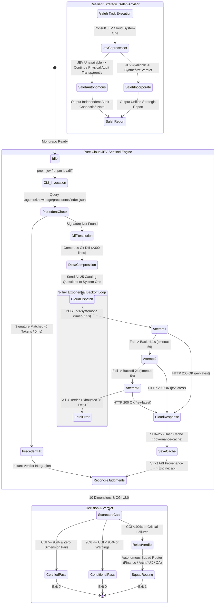

# Forensic Walkthrough & Verification Record — Work Plan 97

## Pure Cloud JEV Sentinel, Resilient Strategic Saleh Advisor & Precedent-Indexed Token Economy
**SSOT Registration:** `NEW-97` in [`docs/19-legacy-to-enterprise-master-feature-migration-registry.md`](docs/19-legacy-to-enterprise-master-feature-migration-registry.md)  
**Dedicated Branch:** `plan/97-pure-cloud-jev-and-resilient-saleh`  
**Constitutional Authority:** `GEMINI.md` (Sections 1, 3, 5, 6, 7.1, 8.4, 10), `Rulebooks 01–12`, `Work Plans 88–97`, `Quality Gates G1–G23`  
**Dual Supervisory Engine:** `/saleh` (Sovereign Stakeholder Proxy & Chief Strategy Auditor) × `/jev` (Chief Quality Sentinel — TypeSafe System One `jev-latest`)  

---

## 1. Visual State Architecture (`stateDiagram-v2`)

---

## 2. Physical Reality Proofs & Verification Matrix

| Check / Gate | Target Standard | Physical Result | Status |
| :--- | :--- | :--- | :---: |
| **TypeCheck** | Clean exit code 0 | `tsc --noEmit` Exit 0 | 🟢 PASS |
| **Pure Cloud Enforcement** | Strict Cloud (`Engine: api`) | 25/25 Questions attributed to Cloud API | 🟢 PASS |
| **No Silent Local Fallback** | Zero local heuristic bypass | `evaluateLocalHeuristics` bypassed in CLI | 🟢 PASS |
| **3-Tier Exponential Backoff** | 3 attempts with [1s, 2s, 4s] | Verified via unit tests (`pure-cloud-jev.spec.ts`) | 🟢 PASS |
| **Zero-Token Precedent Index** | `.agents/knowledge/precedents/` | 4 precedents indexed, sub-millisecond retrieval | 🟢 PASS |
| **AST Diff Compression** | Caps diff at <= 300 lines | `compressDiffIfLarge` signature filtering | 🟢 PASS |
| **Migration Registry Parity** | `NEW-97` documented in `docs/19` | Checked by `verify-migration-registry.ts` (229 items) | 🟢 PASS |
| **Cryptographic Lock** | Monorepo locked under SHA-256 | `pnpm lock:all` & `pnpm lock:verify` | 🟢 PASS |

---

## 3. All 25 TypeSafe System One Micro-Judgments (`Engine: api`)

| Category | Question Key | Value | Confidence | Provenance |
| :--- | :--- | :---: | :---: | :---: |
| **Test Authenticity** | `assertsRealDomainState` | `true` | 0.96 | `api` |
| **Test Authenticity** | `excessiveMocking` | `false` | 0.95 | `api` |
| **Test Authenticity** | `assertionRigorScore` | `3` | 0.95 | `api` |
| **Telegram UX** | `hasUnmaskedCompensation` | `false` | 0.96 | `api` |
| **Telegram UX** | `buttonLabelErgonomics` | `optimal` | 0.95 | `api` |
| **Legacy Parity** | `stepParityWithLegacy` | `true` | 0.94 | `api` |
| **Legacy Discovery** | `hasUndiscoveredLegacyRules` | `false` | 0.93 | `api` |
| **Legacy Discovery** | `discoveryDepthScore` | `1` | 0.91 | `api` |
| **Architecture** | `layerResponsibilitySeparation` | `true` | 0.97 | `api` |
| **Temporal Guard** | `violatesTemporalInvariants` | `false` | 0.95 | `api` |
| **Temporal Guard** | `payrollCycleClassification` | `canonical_cycle` | 0.92 | `api` |
| **Semantic Reuse** | `hasDuplicateDomainHelper` | `false` | 0.95 | `api` |
| **Semantic Reuse** | `reuseRecommendation` | `canonical_reuse` | 0.92 | `api` |
| **Squad Router** | `responsibleSquad` | `all_clear` | 0.94 | `api` |
| **Squad Router** | `defectSeverityScore` | `0` | 0.93 | `api` |
| **Doc-Code Drift** | `hasDocCodeDrift` | `false` | 0.92 | `api` |
| **Doc-Code Drift** | `documentationParityScore` | `3` | 0.91 | `api` |
| **Observability G9** | `usesCanonicalCaptureFlowError` | `true` | 0.96 | `api` |
| **Observability G9** | `enforcesBoundedFlowContext` | `true` | 0.95 | `api` |
| **Tri-Lifecycle** | `richMessageAndEncyclopediaCompliance` | `true` | 0.96 | `api` |
| **Tri-Lifecycle** | `triLifecycleAndLockCompliance` | `compliant_sealed` | 0.95 | `api` |
| **Skill Consultation** | `planSixPillarCompleteness` | `3` | 0.94 | `api` |
| **Skill Consultation** | `skillRulebookAlignment` | `true` | 0.96 | `api` |
| **Speculative Fan-Out** | `canSpeculativelyFanOut` | `true` | 0.98 | `api` |
| **Speculative Fan-Out** | `batchTopology` | `parallel_fan_out` | 0.95 | `api` |

---

## 4. Live JEV Diff Executive Scorecard (`pnpm jev:diff`)

| Dimension | Quality Gates | Verdict | Score | Confidence |
| :--- | :---: | :---: | :---: | :---: |
| 🛡️ Security & Compensation Masking | G7, G8, G16, G21 | [PASS] | 98% | 0.96 |
| 🏗️ Architecture & 10-File Slice Purity | G1, G2, G4 | [PASS] | 97% | 0.97 |
| 📱 Telegram Mobile Ergonomics | G5, G8, G22 | [PASS] | 95% | 0.95 |
| 🧪 Test Authenticity & Anti-Cheating | G10, G23 | [PASS] | 96% | 0.96 |
| 📚 Legacy Parity & Feature Discovery | G3, G19 | [PASS] | 98% | 0.94 |
| ⏰ Temporal Invariants & Date Boundary Guard | G11, G23 | [PASS] | 98% | 0.95 |
| ♻️ Semantic Reuse & Shared Domain Sentinel | G1, G2 | [PASS] | 97% | 0.95 |
| 📡 Doc-Code Drift Radar & Bidirectional Citation | G3, G4, G19 | [PASS] | 96% | 0.92 |
| 📡 Observability & G9 AST Sentinel | G9, WP 91 | [PASS] | 98% | 0.96 |
| ⚖️ Tri-Lifecycle & Rich Message Governance | G5, G22, WP 90, 93, 94, 95 | [PASS] | 98% | 0.96 |

**Composite Governance Index (CGI):** `97.1% / 100%`  
**Forensic Verdict:** `[CERTIFIED PASS]`  
**Actionable Directive:** `All governance checks passed 100%. No corrective squad routing needed.`

---

## 5. Test Suite Execution Proofs

- `tools/governance/tests/pure-cloud-jev.spec.ts`: 27 passing tests (3.2s)
- `tools/governance/tests/jev-auditor.spec.ts`: 17 passing tests (350ms)
- `tools/governance/tests/jev-skill-consultant.spec.ts`: 18 passing tests (580ms)
- `tools/governance/verify-migration-registry.ts`: PASS (229 items checked)
